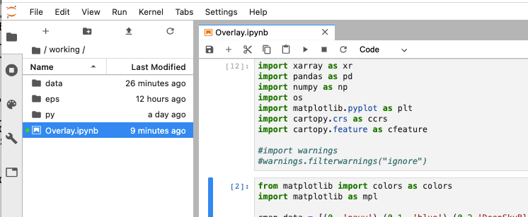

## Directions

- Once you have a notebook to share, go to your JupyterHub window, and make sure the directory listing shows on the left side.  

  

- Hover on the name of the notebook (highlighted in blue in the above image) and **right click** to pick "Open in New Browser Tab". This will download the file to you local machine.  
- Navigate to [notebooks](https://github.com/ocp-cmdg/ingrid2python/new/main/notebooks) and upload the notebook to this folder.
