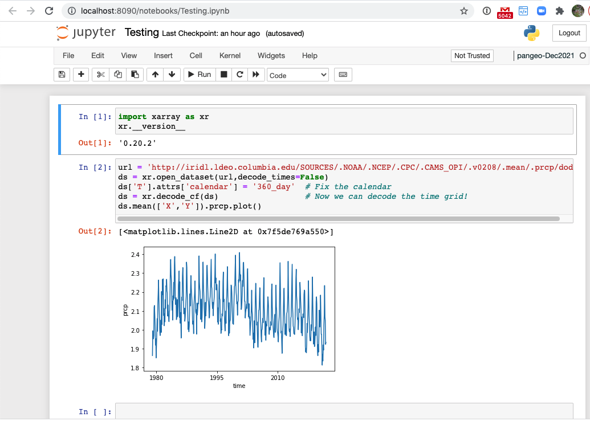
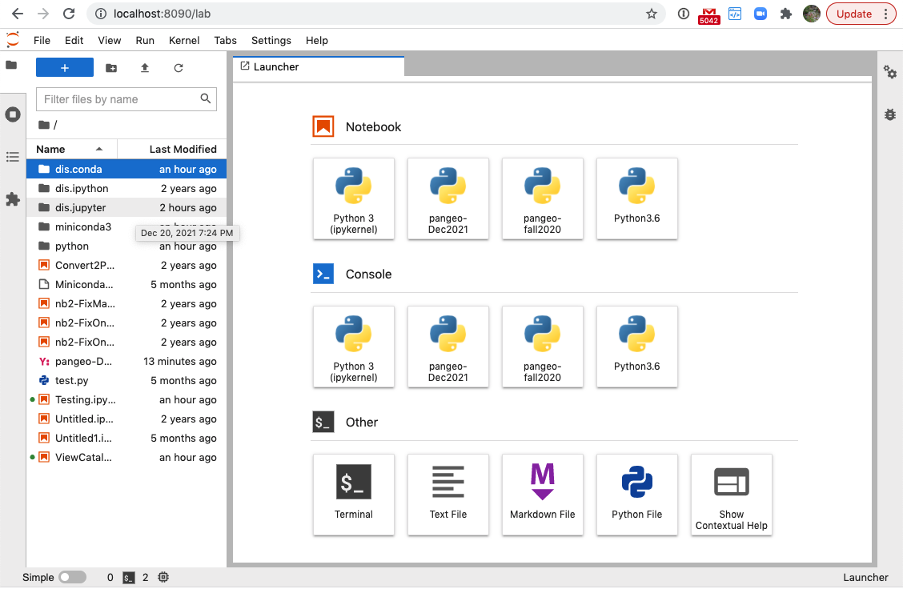

- You will need to have a workable `conda` installed, either the system one or your own (see [Installing Conda](https://github.com/ocp-cmdg/ingrid2python/blob/main/pages/install_conda.md) )

# First choose whether you want a Jupyter Notebook, or a Jupyter Lab:

<table>
  <tr><td>1a. Jupyter Notebook</td><td>1b. Jupyter Lab</td></tr>
  <tr><td></td><td></td></tr>
</table>

# 1a. Jupyter Notebook:
```
# Setup:
conda install jupyter
# Run:
jupyter notebook --no-browser --port=8090
```


# 1b. Jupyter Lab:
```
# Setup:
conda install jupyter
conda install -c conda-forge jupyterlab
jupyter server --generate-config
jupyter server password
# Run:
jupyter lab --no-browser --port=8090 
```
  

# 2. Then start an ssh tunnel on your local machine:
```
ssh -N -L 8090:localhost:8090 <user>@<remote>
```

# 3. Point your browser to http://localhost:8090/


# To see what jupyter processes you have running:
```
jupyter lab list
# or
jupyter notebook list
```


