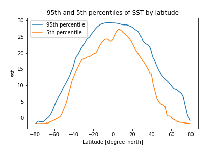

## Advanced Examples


<details> <summary><b>EOFs/PCs </b></summary> <p>  
Find the 3 leading EOFs and PCs. Note that ingrid and `eofs.xarray` use different scalings.

```
%ingrid:
ds .sst {Y cosd}[lon lat][time]svd ev 1 3 RANGE
```

```
#python:
import xarray as xr
from eofs.xarray import Eof  # see [documentation](https://ajdawson.github.io/eofs/latest/api/eofs.xarray.html)
  
ds_anom = ds.groupby('time.month') - ds.groupby('time.month').mean()
solver = Eof(ds_anom.sst)
pcs = solver.pcs(npcs=3)
eofs = solver.eofsAsCorrelation(neofs=3)

eofs.plot(x='lon',y='lat',col='mode',col_wrap=3,add_colorbar=0)
pcs.plot(x='time',col='mode',col_wrap=3);
```
<p> 
<p align="center"></p>
<p align="center"></p>
</p> 
    
</p> </details>

<details> <summary><b>Quantiles</b></summary> <p>  

```
$ingrid
SOURCES .LOCAL .sst.mon.mean.nc .sst [time]average
lat -80 80 RANGEEDGES
[lon]0.05 0.95 0 replacebypercentile
dup
percentile 0.95 VALUE
exch
percentile 0.05 VALUE
```

```
#python
import xarray as xr
from matplotlib import pyplot as plt

ds = xr.open_dataset('http://kage.ldeo.columbia.edu:81/SOURCES/.LOCAL/.sst.mon.mean.nc/.sst/dods')
dss = ds.mean('time').sel(lat=slice(80,-80))
quants = dss.sst.quantile( [0.05, 0.95], dim="lon")
quants.sel(quantile=0.95).plot(label='95th percentile')
quants.sel(quantile=0.05).plot(label='5th percentile')
plt.title('95th and 5th percentiles of SST by latitude')
plt.legend();
```
<p> 
<p align="center"></p>
</p> 

</p> </details>


<details> <summary><b>Depth of the 20 Degree Isotherm</b></summary> <p>  

```
$ingrid
/ds {SOURCES .LOCAL .ORAs5_thetao-clim.nc deptht 0 500 RANGE lat -30 30 RANGE [time]average} def

ds .thetao
deptht exch [20]deptht toS
```
  
```
#python
import xarray as xr
import xgcm.  # need version >= 0.5.2
import numpy as np

url = 'http://kage.ldeo.columbia.edu:81/SOURCES/.LOCAL/.ORAs5_thetao-clim.nc/.thetao/dods'
ds = xr.open_dataset(url,decode_times=False).sel(deptht=slice(0,500),lat=slice(-30,30)).mean('time')

depth_3d = ds.deptht.broadcast_like(ds.thetao)
grid = xgcm.Grid(ds,periodic=False)
h20 = grid.transform(depth_3d, 'Z', np.array([20]), target_data=ds.thetao, method='linear')
```
</p> </details> 
