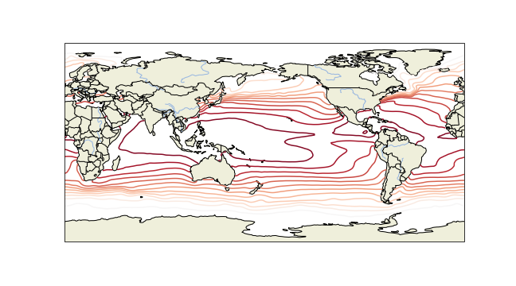

## Plotting Examples

<details> <summary><b>Projections/Transforms/Features</b></summary> <p>  

```
import xarray as xr
import matplotlib.pyplot as plt

import cartopy.crs as ccrs
import cartopy.feature as cfeature
```
  
```
url = 'http://kage.ldeo.columbia.edu:81/SOURCES/.LOCAL/.sst.mon.mean.nc/.sst/time/AVERAGE/dods'
ds = xr.open_dataset(url).sst
```
  
Set a plot size and pick a [cartopy projection](https://scitools.org.uk/cartopy/docs/latest/crs/projections.html)
  
```
fig = plt.figure(figsize=(9, 5))

# Pick a [cartopy projection](https://scitools.org.uk/cartopy/docs/latest/crs/projections.html)
ax = plt.axes(projection=ccrs.PlateCarree(central_longitude=180));
```
Plot coastlines and then pick a [transform](https://scitools.org.uk/cartopy/docs/latest/tutorials/understanding_transform.html).
  
```
ax.coastlines()
ds.plot.contour(ax=ax, transform=ccrs.PlateCarree(),levels=30)
```
Add [features](https://scitools.org.uk/cartopy/docs/latest/matplotlib/feature_interface.html), if desired:  (typing <Tab> after `cfeature.` will list possible completions)
  
```
ax.add_feature(cfeature.LAND)
ax.add_feature(cfeature.RIVERS)
ax.add_feature(cfeature.BORDERS)
```
<p align="center"></p>
  
</p> </details>

<details> <summary><b>Fixing Labels, Making Presentable</b></summary> <p>  

```
%ingrid:
```

```
#python:
```
</p> </details>
