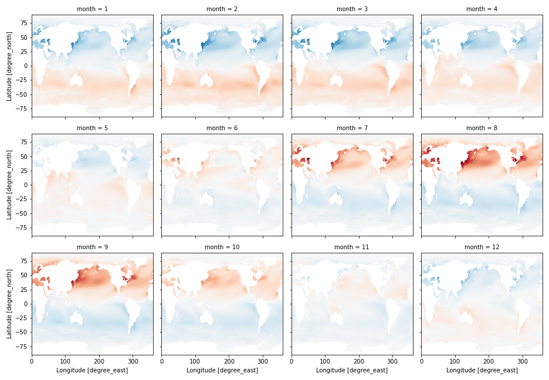
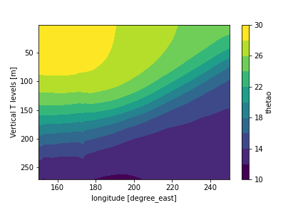
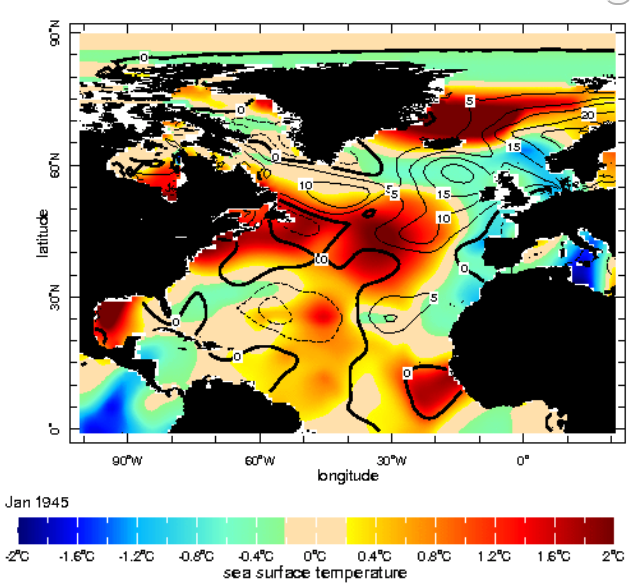
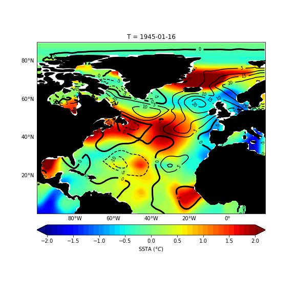
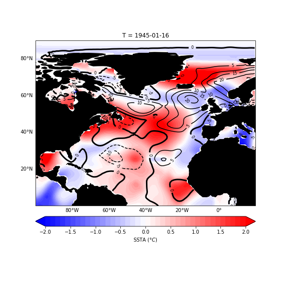

## Plotting Examples

<details> <summary><b>Projections/Transforms/Features</b></summary> <p>  

```
import xarray as xr
import matplotlib.pyplot as plt

import cartopy.crs as ccrs
import cartopy.feature as cfeature
```
  
```
url = 'http://kage.ldeo.columbia.edu:81/SOURCES/.LOCAL/.sst.mon.mean.nc/.sst/time/AVERAGE/dods'
ds = xr.open_dataset(url).sst
```
  
Set a plot size and pick a [cartopy projection](https://scitools.org.uk/cartopy/docs/latest/crs/projections.html)
  
```
fig = plt.figure(figsize=(9, 5))

# Pick a [cartopy projection](https://scitools.org.uk/cartopy/docs/latest/crs/projections.html)
ax = plt.axes(projection=ccrs.PlateCarree(central_longitude=180));
```
Plot coastlines and then pick a [transform](https://scitools.org.uk/cartopy/docs/latest/tutorials/understanding_transform.html).
  
```
ax.coastlines()
ds.plot.contour(ax=ax, transform=ccrs.PlateCarree(),levels=30)
```
Add [feature](https://scitools.org.uk/cartopy/docs/latest/matplotlib/feature_interface.html), if desired:  (typing \<Tab\> after `cfeature.` will list possible completions)
  
```
ax.add_feature(cfeature.BORDERS)
```
<p align="center"></p>
</p> </details>


<details> <summary><b>More Features, Labels</b></summary> <p>  

```
import numpy as np
import xarray as xr
import matplotlib.pyplot as plt
import cartopy.crs as ccrs
import cartopy.feature as cfeature
```
  
```
url = 'http://kage.ldeo.columbia.edu:81/SOURCES/.LOCAL/.sst.mon.mean.nc/.sst/time/AVERAGE/dods'
ds = xr.open_dataset(url).sel(lat=slice(50,-50)).sst
```
  
```
fig = plt.figure(figsize=(8,5))
ax = plt.axes(projection=ccrs.PlateCarree(central_longitude=180))
ax.set_extent([100, 290, -50, 50], crs=ccrs.PlateCarree())

# Put a background image on for nice sea rendering.
ax.stock_img()
CS = ds.plot.contour(ax=ax, transform=ccrs.PlateCarree(),colors='k',vmin=10,vmax=30,levels=11)
# Add labels on contours
ax.clabel(CS, inline=1, fontsize=8, fmt='%1.0f')

# Create a feature for States/Admin 1 regions at 1:50m from Natural Earth
states_provinces = cfeature.NaturalEarthFeature(
    category='cultural',
    name='admin_1_states_provinces_lines',
    scale='50m',
    facecolor='none')

ax.add_feature(cfeature.COASTLINE,zorder=3)
ax.add_feature(cfeature.BORDERS, edgecolor='gray')
ax.add_feature(states_provinces, edgecolor='gray')

# Add longitude, latitude labels
gl = ax.gridlines(draw_labels=True, alpha=0.0, xlocs=np.arange(-160,181,20))
gl.top_labels = False
```
<p align="center"></p>
</p> </details>

<details> <summary><b>Subplots</b></summary> <p>  

The built-in xarray plotting allows for multiple plots:
  
```
ds = xr.open_dataset('http://kage.ldeo.columbia.edu:81/SOURCES/.LOCAL/.sst.mon.mean.nc/.sst/dods')
ds_mon_anom = ds.groupby('time.month').mean() - ds.mean('time')
ds_mon_anom.sst.plot(x='lon',y='lat',col='month',col_wrap=4,add_colorbar=0);
```
<p align="center"></p>
  
But much more control is possible when using `matplotlib` directly, see [subplots](https://matplotlib.org/stable/gallery/subplots_axes_and_figures/subplots_demo.html).
</p> </details>

<details> <summary><b>Reversing Grid Direction</b></summary> <p>  

The keyword arguments `xincrease` and `yincrease` control the axis direction. 
   
```
import xarray as xr
url = 'http://kage.ldeo.columbia.edu:81/SOURCES/.LOCAL/.ORAs5_thetao-clim.nc/.thetao/dods'
ds = xr.open_dataset(url,decode_times=False).sel(deptht=slice(0,300),lat=slice(-30,30),lon=slice(150,250)).mean('time')

ds.thetao.sel(lat=slice(-2,2)).mean('lat').plot.contourf(vmin=10,vmax=30,levels=11,yincrease=False)
```
<p align="center"></p>
  
</p> </details>
<details> <summary><b>Types of Plots</b></summary> <p>  

Plotting DataArrays: For examples of all of the following, see [xarray plotting](http://xarray.pydata.org/en/stable/user-guide/plotting.html)
  
- da.plot.pcolormesh()
- da.plot.contour()
- da.plot.contourf()
- da.plot.imshow()
- da.plot.line()
- da.plot.hist()
- da.plot.bar()
- da.plot.step()
- da.plot.surface()
- ds.plot.scatter()
- ds.plot.quiver()
- ds.plot.streamplot()
  
There are also other plotting methods, such as ds.plot.violin, ds.plot.bivariate, ds.plot.table, etc.
  
IRIDL has started using [hvplot](https://hvplot.holoviz.org/), which is an interactive plotting tool. We have installed it on `carney`, and find it cute, but somewhat frustrating.
  
</p> </details>

<details> <summary><b>Overlay Contours on Colors</b></summary> <p>  

```
%ingrid
 SOURCES .DASILVA .SMD94 .anomalies .sst correlationcolorscale
  DATA -2 2 RANGE
  X -100 20 RANGE
  Y 0 90 RANGE
  /color_smoothing null def
 SOURCES .DASILVA .SMD94 .anomalies .slp
   X -100 20 RANGE
   Y 0 90 RANGE
   DATA 5 STEP
   X Y fig: colors contours land :fig
```
  
```
#python
import xarray as xr
import pandas as pd
import numpy as np
import matplotlib.pyplot as plt
import cartopy.crs as ccrs
import cartopy.feature as cfeature  

# Get the Dataset
url = 'http://kage.ldeo.columbia.edu:81/SOURCES/.DASILVA/.SMD94/.anomalies/.sst/dods'
url2 = 'http://kage.ldeo.columbia.edu:81/SOURCES/.DASILVA/.SMD94/.anomalies/.slp/dods'

ds = xr.open_dataset(url,decode_times=False)
ds['slp'] = xr.open_dataset(url2,decode_times=False).slp

# Fix the grids
ds['T'] = pd.date_range('1945-01',periods=len(ds.T), freq='MS').shift(15,freq='D')
ds.coords['X'] = (ds.coords['X'] + 180) % 360 - 180
ds = ds.sortby(ds.X)

# Restrict the domain
dss = ds.sel(X=slice(-100,20),Y=slice(-10,90)).isel(T=0).load()

# Now make the figure
fig = plt.figure(figsize=(8,8))

ax = plt.axes(projection=ccrs.PlateCarree(central_longitude=0))
ax.set_extent([-100, 20, 0, 90], crs=ccrs.PlateCarree())

cb = dss.sst.plot.contourf(ax=ax, transform=ccrs.PlateCarree(), vmin=-2, vmax=2, levels=41, cmap='jet', add_colorbar=False,rasterized=True)
CS = dss.slp.plot.contour(ax=ax, colors= 'k', transform=ccrs.PlateCarree(), vmin=-20,vmax=20,levels=9)
CS.collections[4].set_linewidth(3) 
ax.clabel(CS, inline=1, fontsize=8, fmt='%1.0f')
ax.add_feature(cfeature.LAND,facecolor='k')
cbar = plt.colorbar(cb, shrink=1.0, pad=.05, label=r'SSTA ($\degree C$)', orientation='horizontal')
gl = ax.gridlines(draw_labels=True, alpha=0.0, xlocs=np.arange(-160,181,20))
gl.top_labels = False
gl.right_labels = False
```
  <div align="center"><table cellpadding="0" cellspacing="0">

    <tr><td align="center">ingrid</td><td align="center">cmap = 'jet'</td></tr>
    <tr><td></td><td></td></tr>
    <tr><td align="center">cmap = 'bwr'</td><td align="center">cmap = 'jet'</td></tr>
    <tr><td></td><td></tr></table></div>
</p> </details>

