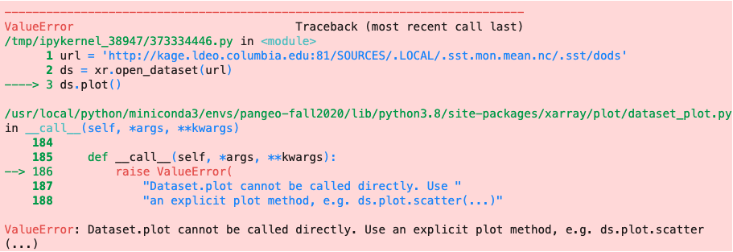

## Troubleshooting

- Read the pink error messages, starting at the end
- These error messages are generated by the open-source code. They were added in by the programmer to be helpful
- Search the web, someone else has almost always asked the question before!
- \<Tab\> and \<Shift\>\<Tab\> give contextual help in a Jupyter Notebook

<details> <summary><b>Replacing `Ingrid` Time Grids</b></summary> <p>  
  
  For the most recent versions of `xarray`, we can replace an ingrid time grid just by changing its calendar and re-decoding. If `xr.decode_df` complains: "AttributeError: module 'cftime' has no attribute 'utime'", then you will need to hard code in the correct time using `pd.date_range`.

New way:
  
```
import xarray as xr
  
# Assuming the time grid is called 'T':
url = 'http://iridl.ldeo.columbia.edu/SOURCES/.NOAA/.NCEP/.CPC/.CAMS_OPI/.v0208/.mean/.prcp/dods'
ds = xr.open_dataset(url,decode_times=False)
ds['T'].attrs['calendar'] = '360_day'  # Fix the calendar
ds = xr.decode_cf(ds)                  # Now we can decode the time grid!
```
  
Old way:
```
import xarray as xr
import pandas as pd
  
url = 'http://iridl.ldeo.columbia.edu/SOURCES/.NOAA/.NCEP/.CPC/.CAMS_OPI/.v0208/.mean/.prcp/dods'
ds = xr.open_dataset(url,decode_times=False)
ds['T'] = pd.date_range('1979-01',periods = len(ds['T']),freq='MS').shift(15, freq='D') 
```
</p> </details> 

<details> <summary><b>Tweaking CF-compliant Time Grids</b></summary> <p>  
  
If your dataset, `ds`, is giving trouble with the time grid, `time`,  (as happens frequently), just replace it!
  
So here is my crude recipe to replace troublesome standard time grids with time-centered `datetime64`. Note that there are many variations of frequencies, so please check your time grid after replacement and adjust the recipe accordingly.
  
```
# Replace a time grid which starts at the first of the month to one which is centered in the month
url = 'http://kage.ldeo.columbia.edu:81/SOURCES/.LOCAL/.sst.mon.mean.nc/dods'
ds = xr.open_dataset(url)

first_time = str(ds.time.values[0])
  
freq = xr.infer_freq(ds.time)
print(freq)
time = pd.date_range(first_time, periods=len(ds.time), freq=freq)
if 'D' in freq:
    ds['time'] = time.shift(12, freq='H') 
elif 'M' in freq:   
    ds['time'] = time.shift(15, freq='D') 
elif 'A' in freq:
    ds['time'] = time.shift(6, freq='M') 
ds.time  

```
</p> </details> 

<details> <summary><b>DataSets vs. DataArrays</b></summary> <p>  
  
- An `xarray DataSet` contains `xarray DataArrays`.  Each DataArray usually corresponds to what we think of as one variable. A good convention, so you remember which you are dealing with, is to call Datasets: `ds_{name}` and DataArrays: `da_{name}`. 
- You cannot plot a Dataset, only a DataArray. A pink error results: 
  
<p align="center"></p>
  
- You can combine DataArrays in one Dataset
- You can convert a DataArray into a Dataset - if the DataArray doesn't know the name of the variable, you can specify it.
  
For our usual example:

    
```
url = 'http://kage.ldeo.columbia.edu:81/SOURCES/.LOCAL/.sst.mon.mean.nc/.sst/dods'
ds = xr.open_dataset(url)
da = ds.sst
ds_new = da.to_dataset(name='sst')
```
  
</p> </details> 

<details> <summary><b>Check Basic Information</b></summary> <p>  
    
```
import xarray as xr
# Print version of a package
print(xr.__version__)
  
url = 'http://kage.ldeo.columbia.edu:81/SOURCES/.LOCAL/.sst.mon.mean.nc/.sst/dods'
ds = xr.open_dataset(url)  
# Print version of a package
print(ds.info())
  
# print size of dataset in megabytes
print(ds.nbytes/1e6,'M')
  
# print names and sizes of dimensions
print(ds.dims)
```
  
</p> </details> 

<details> <summary><b>IRIDL OPeNDAP(dods) Data Corruption</b></summary> <p>  
For `xarray` versions >= 16.1, the chunking of data can corrupt the dataset.  Although we don't know the root cause, there is a fix. Use `chunks=-1` (or `chunks={}`) in the call to `xr.open_dataset` to load the data in a single chunk. Then append a `.load()` to convert the dask object back to a `dataset`.
  
```
import xarray as xr

url = 'http://iridl.ldeo.columbia.edu/SOURCES/.WCRP/.GCOS/.GPCC/.FDP/.version2018/.1p0/.prcp/dods'

ds = xr.open_dataset(url,decode_times=False,chunks=-1).load()
ds = ds.rename({'T':'time'}).sortby('Y').sel(X=slice(-120,-95),Y=slice(25,40))
dst = ds.mean(['Y','X'])
dst.prcp.plot()
```
  
</p> </details> 

[//]: # (This is the beginning.)  

<details> <summary><b>Longitude and Latitude Grids</b></summary> <p>  
Many difficulties arise when the Longitude grid is [-180,180] and a calculation requires [0,360] or when
  the Latitude grid is North to South instead of South to North.  These are simple problems which can be easily fixed.
  
```
# Switch North to South 
ds = ds.sortby('lat')
  
# Longitude [-180,180] to [0,360]
import numpy as np
ds.coords['lon'] = np.mod(ds['lon'], 360)
ds = ds.reindex({ 'lon' : np.sort(ds['lon'])})

# Longitude [0,360] to [lon_start,360+lon_start] 
ds.coords['lon'] = (ds.coords['lon'] - lon_start) % 360 + lon_start
ds = ds.sortby(ds.lon)
```
</p> </details> 

<details> <summary><b>Clipped or Overlapping labels</b></summary> <p>  
Don't forget to throw in a `plt.tight_layout()` command whenever you are having trouble with the bottom label being clipped, or multiple plots being squished together! Make sure you use it BEFORE saving the plot!
  
```
plt.tight_layout()
```
</p> </details> 
